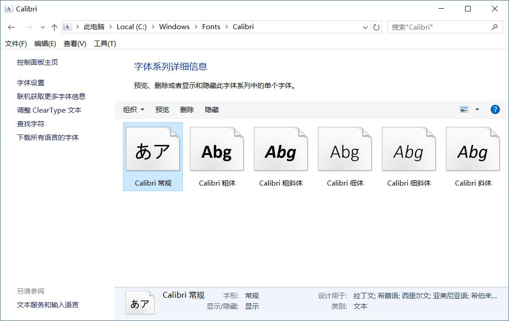
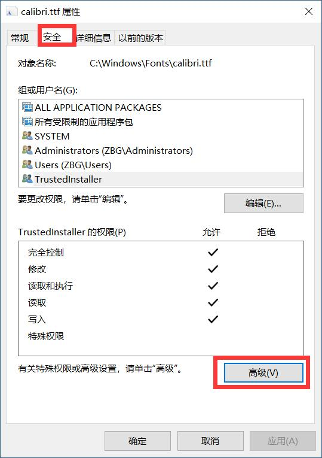
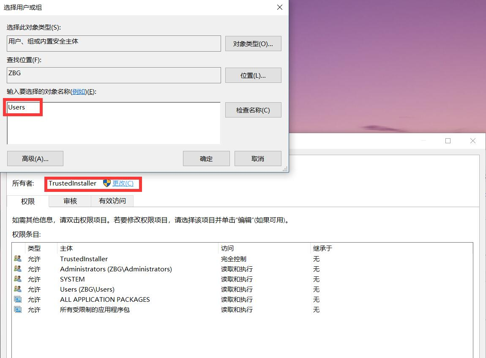
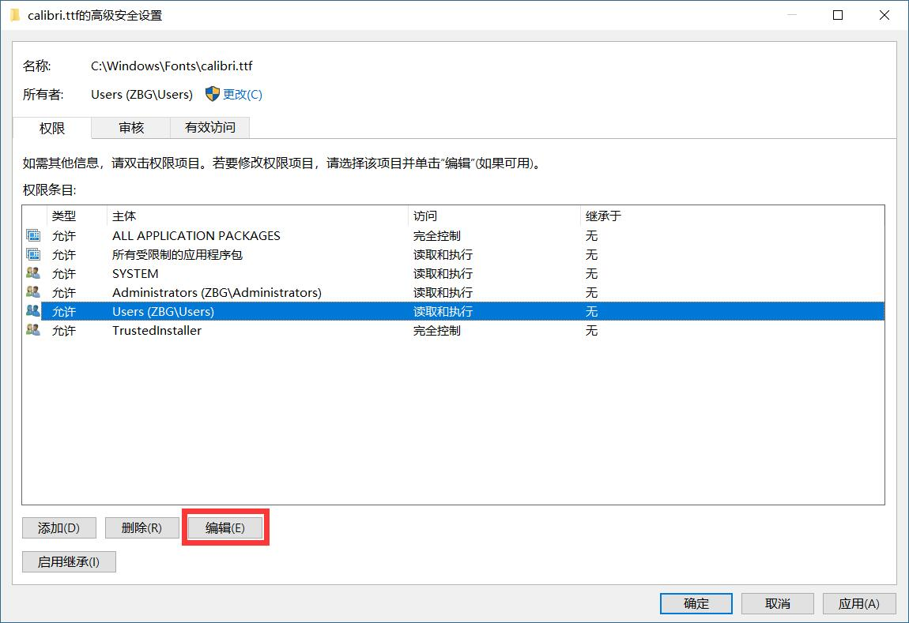
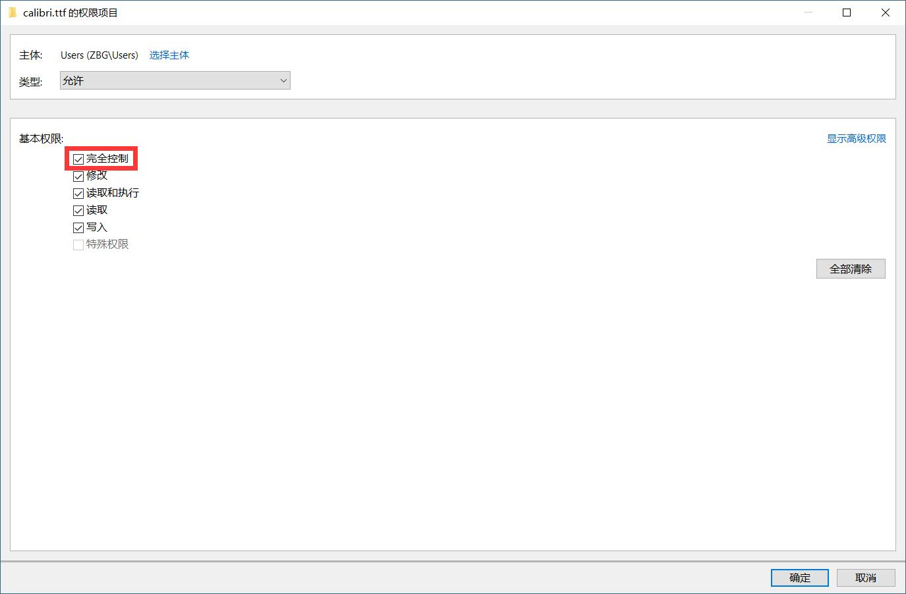

# onenote_font
中文环境下，OneNote中输入中文会被强制为宋体，输入英语时变为Calibri，很不舒服。
可以用微软雅黑来替代（其他字体当然亦可，全凭喜好），无论输入中英文都统一为微软雅黑，操作如下：
## 修改字体设置
进入C:\Windows\Fonts\Calibri，右键“Calibri常规-属性-安全-高级”里将所有者从“TrustedInstaller”改为“Users”（直接输入即可），然后在编辑里将Users的完全控制选上；

## 提取修改字体
下载FontCreator并安装打开，进入“文件-打开已安装字体”，选择微软雅黑Regular（或Microsoft YaHei UI），将ttc文件提取为两个ttf文件；然后之后把任意一个拖入软件窗口内，进入“字体-属性-标识符”，先将字系改为Calibri，然后进入自定义，将里面内容全删；最后进入“文件-输出字体-TrueType”，保存。
所有文件可以在本仓库中找到，其中msyh_0.ttf、msyh_1.ttf为微软雅黑字体提取文件，OneNote.ttf为最终字体文件，OneNote.fcp是FontCreator工程文件。
msyh_0.ttf、msyh_1.ttf为微软雅黑字体提取文件，OneNote.ttf为最终字体文件，OneNote.fcp是FontCreator工程文件。

## 安装并替换字体
双击OneNote.ttf安装Calibri字体即可（提示是否替换时选择“是”）

## Reference
[OneNote英文字体自动变成Calibri的问题有没有什么解决办法？](https://www.zhihu.com/question/30089364/answer/235971324)
